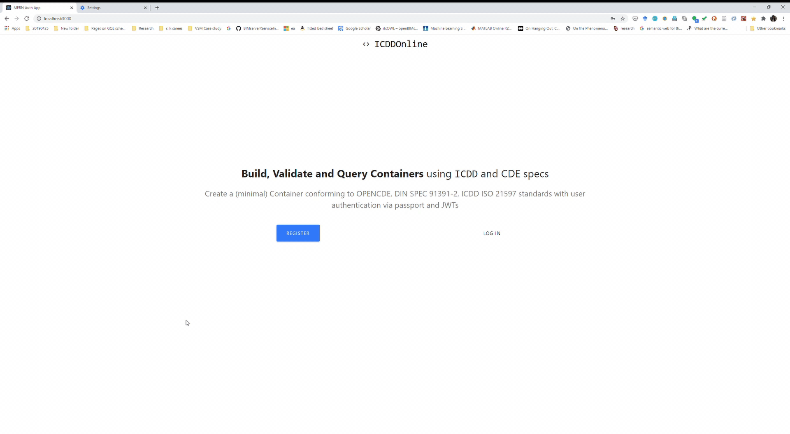

# ICDDOnline - A simple implementation of ICDD



An initial implementation of the Container concepts according to ICDD ISO 21597, DIN SPEC 91391, ISO 19650, and LDP. 

## Current Status

Minimal full-stack MERN app with authentication using passport and JWTs. In buit Index.ttl which can be queried using HyperGraphQL.

This project uses the following technologies:

- [React](https://reactjs.org) and [React Router](https://reacttraining.com/react-router/) for frontend
- [Express](http://expressjs.com/) and [Node](https://nodejs.org/en/) for the backend
- [MongoDB](https://www.mongodb.com/) for the database
- [Redux](https://redux.js.org/basics/usagewithreact) for state management between React components

## Running the Code
1. Install MongoDB and create credentials. Add `MONGOURI` from your [mLab](http://mlab.com) database in `config/keys.js`.

```javascript
module.exports = {
  mongoURI: "YOUR_MONGO_URI_HERE",
  secretOrKey: "secret"
};
```
2. Install all dependencies by running the below command for client and server dependent packages
```javascript
npm install && npm run client-install
```

3. Start up both client and server using the below command:
```javascript
npm run dev
```

4. Webpage opens on http://localhost:3000 (which is the client address)

## Inspiration

This work draws from the tutorials below:

- [Build a Login/Auth App with the MERN Stack — Part 1 (Backend)](https://blog.bitsrc.io/build-a-login-auth-app-with-mern-stack-part-1-c405048e3669)
- [Build a Login/Auth App with the MERN Stack — Part 2 (Frontend & Redux Setup)](https://blog.bitsrc.io/build-a-login-auth-app-with-mern-stack-part-2-frontend-6eac4e38ee82)
- [Build a Login/Auth App with the MERN Stack — Part 3 (Linking Redux with React Components)](https://blog.bitsrc.io/build-a-login-auth-app-with-the-mern-stack-part-3-react-components-88190f8db718)

